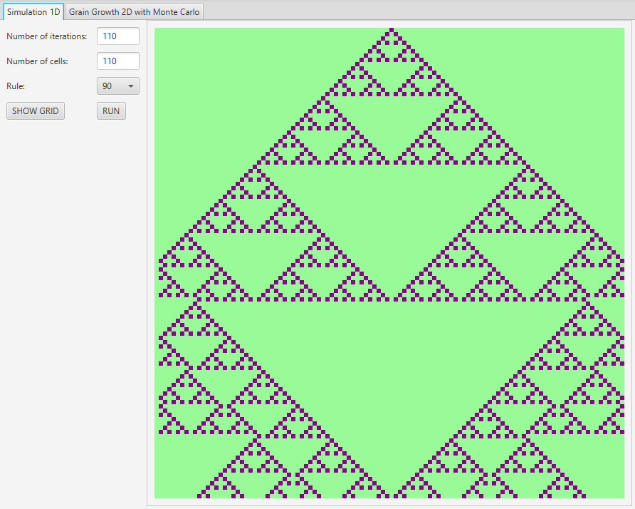
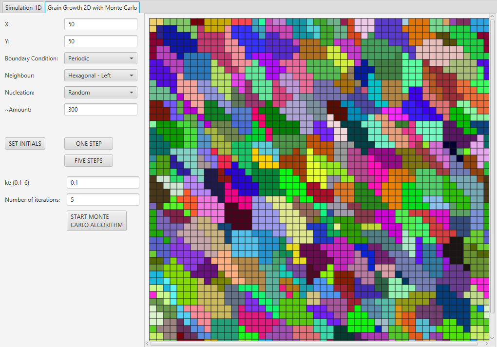

# Cellular automaton
Cellular automaton simulation using JavaFX. 
- Cellular automaton 1D
- Grain Growth 2D
- Smoothing edges using Monte Carlo method

App is available on: https://karolinawidz.github.io/cellular-automaton/

 



## Technologies
- Java 8
- JavaFX
- Maven
- TestFX
- Lombok (version 1.18.12)

## Prerequisites
  To run this project you need:
  <ul>
    <li>Java Runtime Environment - <a href=https://www.java.com/pl/download/> click here to download.</a></li>
  </ul>
  
  If the app doesn't run automatically, open command line in folder with the app and run it with:
  ```
  java -jar cellular_automaton.jar
  ```
